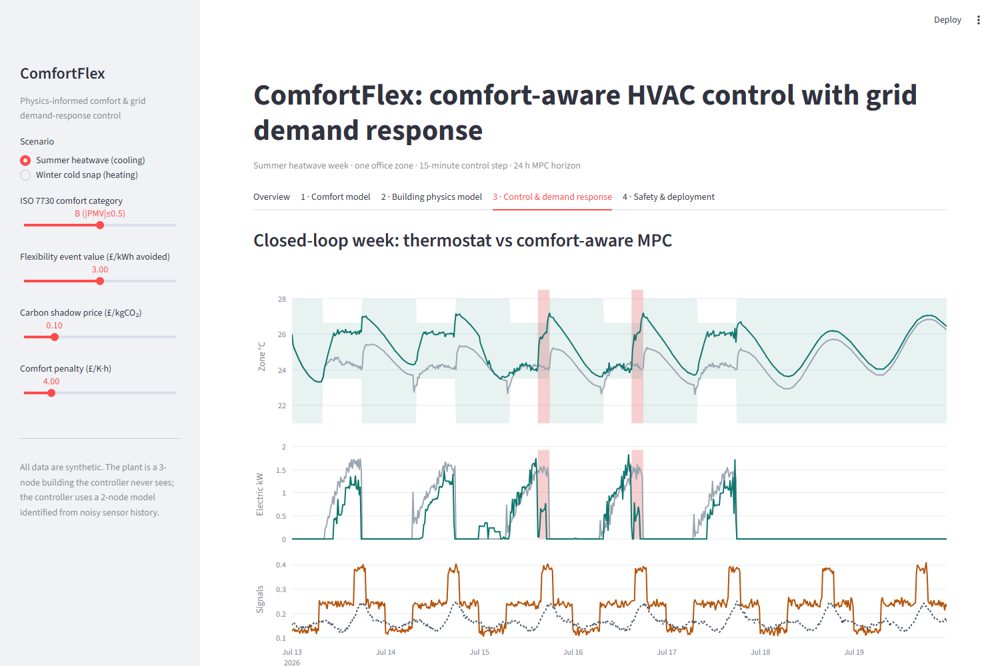

# ComfortFlex

[](https://github.com/malikwaqas077/comfortflex/actions/workflows/ci.yml)

**Physics-informed thermal comfort and grid demand-response control for commercial HVAC.**

ComfortFlex takes a building zone from human-comfort physics, through a thermal model learned from sensor data, to
a grid-aware controller with the safety layer it needs to run on live plant. It covers the path a building-physics
model follows from research into production:

| Layer | What it does | Where |
|---|---|---|
| **Human comfort** | ISO 7730 PMV/PPD (Fanger) and EN 16798-1 adaptive comfort; inverts \|PMV\| ≤ limit into an operative-temperature band the controller can track | `comfortflex/comfort.py` |
| **Building physics** | 2R2C grey-box RC model (air + thermal mass), exact ZOH discretisation, identified from noisy 15-min sensor history by multi-step simulation-error minimisation; validated on a held-out week | `thermal.py`, `identify.py` |
| **State estimation** | Disturbance-augmented Kalman filter: recovers the unmeasured mass temperature and an unmeasured heat gain, which makes the MPC offset-free under model mismatch | `control.py` |
| **Grid-aware MPC** | 24 h linear-programme MPC (HiGHS) minimising tariff cost + carbon shadow price + demand-flexibility event value, with soft PMV comfort constraints, back-off margin, ramp limits and move suppression | `control.py` |
| **Flexibility quantification** | Hours the HVAC can stay off at event start before leaving the comfort band, the figure an aggregator needs for a bid | `control.py` |
| **Deployment safety** | Sensor plausibility and staleness checks, seasonal changeover, power and ramp clamps, fallback to the BMS schedule on sensor or optimiser failure, and an audit log | `control.py` |
| **Dashboard** | Streamlit app covering every layer with interactive comfort and pricing parameters | `app.py` |



## Results (one-week closed-loop simulation, one office zone)

The simulated "true" building is a **3-node** RC model that the controller never sees. The controller uses a
**2-node** model identified from a week of noisy, thermostat-operated history, so model mismatch is built in on
purpose, as it would be in a real building. Sensor readings are noisy and quantised to 0.1 °C, weather and occupancy
forecasts are noisy, and a one-hour wireless sensor outage is injected mid-week.

Baseline: a scheduled **PI thermostat** with anti-windup, i.e. typical BMS behaviour (24 °C cooling / 21 °C heating
when occupied, setback otherwise).

| KPI (thermostat → ComfortFlex) | Summer heatwave (cooling) | Winter cold snap (heating) |
|---|---|---|
| Load during flexibility events | 8.8 → 2.0 kWh (**−77%**) | 6.8 → 0.0 kWh (**−100%**) |
| Flexibility payment at £3/kWh vs baseline | **£20.35** | **£20.41** |
| Electricity cost (excl. flexibility payment) | £15.55 → £10.29 (**−34%**) | £76.63 → £72.46 (−5%) |
| Grid CO₂ | 9.35 → 6.23 kg (**−33%**) | 57.5 → 59.4 kg (+3%) |
| Energy | 56.0 → 39.1 kWh (−30%) | 358 → 376 kWh (+5%) |
| Occupied time with \|PMV\| ≤ 0.5 | 96.5% → 97.5% | 97.5% → 100% |
| Discomfort (K·h outside band) | 0.38 → 0.24 | 0.38 → 0.00 |
| Model, 7-day open-loop prediction on held-out week | RMSE 0.18 K, CV(RMSE) 0.8% | RMSE 0.33 K, CV(RMSE) 1.9% |

**Reading the results honestly.**

- *Summer:* the savings come from holding a **PMV-derived band** rather than a fixed 24 °C setpoint, from pre-cooling
  the thermal mass in cheaper, cooler and lower-carbon hours (higher COP), and from coasting through the event.
- *Winter:* the controller's main value is **flexibility and comfort**, not kWh. It stores heat in the building
  fabric ahead of the 16:00–19:00 event and the evening price peak, removing all event load and all occupied
  discomfort. Storing heat early costs about 5% more energy through extra fabric losses. This trade-off is set by the
  tariff and the carbon shadow price, both adjustable in the dashboard.
- Setback and frost-protection limits are enforced when the building is unoccupied. An earlier version let the zone
  drift below them at weekends, which overstated the winter savings; the end-to-end test now checks for this.

## Quick start

```bash
pip install -r requirements.txt
pytest -q                  # 26 tests, ~30 s
streamlit run app.py       # dashboard at http://localhost:8501
```

## Verification

- **PMV/PPD** reproduces ten ISO 7730:2005 Annex D reference cases to ±0.02 PMV (`tests/test_comfort.py`).
- **Discretisation** converges to the analytic steady state; matches forward-Euler for vanishing step.
- **Identification** recovers a known model's heat-loss coefficient within 3% from data, and generalises to an
  unseen week of the structurally different plant.
- **Kalman filter** recovers a hidden thermal-mass temperature from the air sensor alone.
- **MPC** plans respect comfort, ramp and seasonal-mode constraints, and shift load out of flexibility events.
- **Safety guard** rejects implausible or stale data, falls back on optimiser failure, and rate-limits commands.
- **End-to-end** winter run beats the thermostat on cost, DR load and comfort, rides through a sensor outage, and holds frost protection.

## Honest limitations and next steps

This is a self-contained demonstrator on synthetic data, not a validated product. To take it to live buildings:

- Use **operative temperature** from globe or surface sensors rather than air temperature for PMV.
- **Calibrate PMV inputs** (clo, met) per site, and learn comfort bands from occupant feedback (e.g. Bayesian update
  of the neutral temperature).
- **Multi-zone** coupled models; humidity and latent loads; fan and AHU energy; VRF part-load curves.
- **Hybrid physics-ML**: keep the RC backbone for extrapolation and safety, and learn residuals (occupancy, solar
  shading) with gradient boosting or a small neural network.
- **Rolling re-identification** with drift detection; uncertainty-aware (stochastic or tube) MPC.
- **Replay** against measured sensor and BMS data from a pilot site, then supervised closed-loop trials with A/B
  weeks and IPMVP-style savings verification.
- Grid services integration: event signals from the ESO Demand Flexibility Service or DNO flexibility markets.

## Project layout

```
comfortflex/
  comfort.py    ISO 7730 PMV/PPD, EN 16798-1 adaptive comfort, band inversion
  thermal.py    RC2 (controller model) and RC3 (simulated plant), ZOH discretisation
  identify.py   grey-box parameter estimation and Guideline-14 style validation metrics
  control.py    heat pump, PI thermostat, Kalman estimator, LP-MPC, flexibility, safety guard
  scenario.py   weather, occupancy, tariff, grid carbon and flexibility-event generator
  pipeline.py   history -> identification -> closed loop -> KPIs
app.py          Streamlit dashboard
tests/          26 pytest tests
```

Author: **Waqas Ahmad**, MSc Artificial Intelligence & Data Science. Built as an independent demonstrator of
applied building-physics modelling and AI control. MIT licence.
